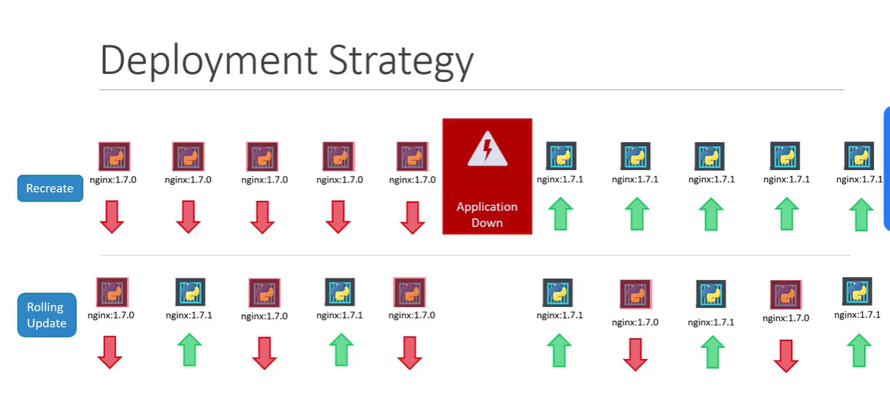

# Application Lifecycle Management

## 📌 Description

Application Lifecycle Management in Kubernetes covers everything from **deploying and updating applications** to managing their **configuration, secrets, scaling, and container initialization**.

## 🧩 Key Areas

| Topic | What it covers |
|---|---|
| [[Rolling Updates And Rollbacks]] | Zero-downtime deploys and reverting bad releases |
| [[Commands and Arguments in Docker or Kubernetes]] | Override ENTRYPOINT/CMD in pod specs |
| [[Config Env Vars in Applications]] | Inject environment variables into containers |
| [[ConfigMaps in Kubernetes]] | Store non-sensitive config as key-value pairs |
| [[Secrets]] | Store sensitive data (passwords, tokens) |
| [[Secret Store CSI Driver]] | Mount secrets from external vaults via CSI |
| [[Encrypting Secret data at Rest]] | Encrypt secrets stored in etcd |
| [[Multi Container Pods]] | Sidecar, ambassador, and adapter patterns |
| [[Init Containers]] | Run setup tasks before the main container starts |
| [[Autoscaling in Kubernetes]] | HPA, VPA, and KEDA-based autoscaling |
| [[In-place Resize of Pod]] | Resize CPU/memory without restarting pods |

## 📂 Subtopics

- [[Rolling Updates And Rollbacks]]
- [[Commands and Arguments in Docker or Kubernetes]]
- [[Config Env Vars in Applications]]
- [[ConfigMaps in Kubernetes]]
- [[Secrets]]
- [[Secret Store CSI Driver]]
- [[Encrypting Secret data at Rest]]
- [[Multi Container Pods]]
- [[Init Containers]]
- [[Autoscaling in Kubernetes]]
- [[In-place Resize of Pod]]

🏷️ Tags: #LifeCycle #Application #secrets #updates #deploy #release #configmap #k8s
