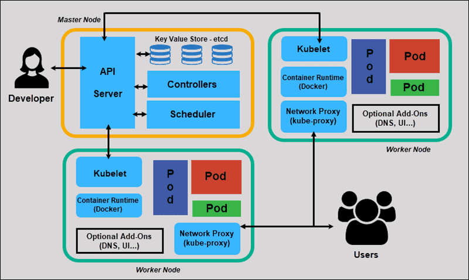

## 📌 Description

Kubernetes follows a **master-worker** architecture. The **Control Plane** manages the cluster state; **Worker Nodes** run the actual workloads.

## 🧩 Control Plane Components

| Component | Role |
|---|---|
| [[Kube-Api Server]] | Single entry point for all cluster operations |
| [[ETCD]] | Distributed key-value store — source of truth for cluster state |
| [[Kube-Controller-Manager]] | Runs controllers (node, replication, endpoints, etc.) |
| [[Kube-sheduler]] | Assigns pods to nodes based on resources and constraints |

## 🖥 Worker Node Components

| Component | Role |
|---|---|
| [[Kubelet]] | Agent on every node — ensures containers run as specified |
| [[kube-proxy]] | Manages network rules for Service routing on each node |
| Container Runtime | Runs containers (containerd, CRI-O, Docker) |

## 📂 Subtopics

- [[Cluster Architecture]]
- [[ETCD]]
- [[Kube-Api Server]]
- [[Kube-Controller-Manager]]
- [[Kube-sheduler]]
- [[Kubelet]]
- [[kube-proxy]]

## 🔗 Useful Links

- [Kubernetes Architecture Docs](https://kubernetes.io/docs/concepts/architecture/)

🏷️ Tags: #architecture #controlplane #kubelet #etcd #scheduler #k8s
