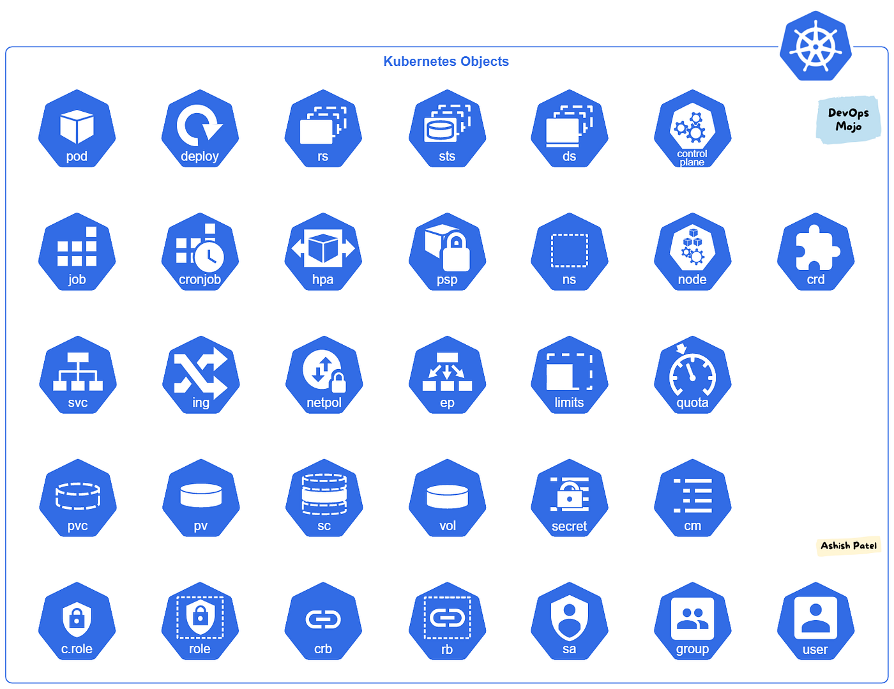

## 📌 Description

Kubernetes **workload objects** define *what* runs in your cluster and *how*. They map to real containerized processes managed by the control plane.

## 🧩 Core Objects

| Object | Purpose |
|---|---|
| [[Pod]] | Smallest deployable unit — one or more containers sharing network/storage |
| [[ReplicaSet]] | Ensures a specified number of Pod replicas are running |
| [[Deployments]] | Manages ReplicaSets; handles rolling updates and rollbacks |
| [[DaemonSet]] | Runs one Pod per node (e.g., log collectors, monitoring agents) |
| [[Static Pod]] | Pod managed directly by kubelet, not the API server |
| [[Namespaces]] | Virtual clusters for resource isolation and multi-tenancy |
| [[Services]] | Stable network endpoint to expose a set of Pods |

## 🔌 Service Types

- [[ClusterIP Service]] — internal only (default)
- [[NodePort Service]] — exposes on a port on every node
- [[Load Balancer Service]] — provisioned via cloud provider

## 📂 Subtopics

- [[Kubernetes Objects]]
- [[Pod]]
- [[ReplicaSet]]
- [[Deployments]]
- [[DaemonSet]]
- [[Static Pod]]
- [[Namespaces]]
- [[Services]]

🏷️ Tags: #workloads #pods #deployments #services #replicaset #daemonset #k8s
