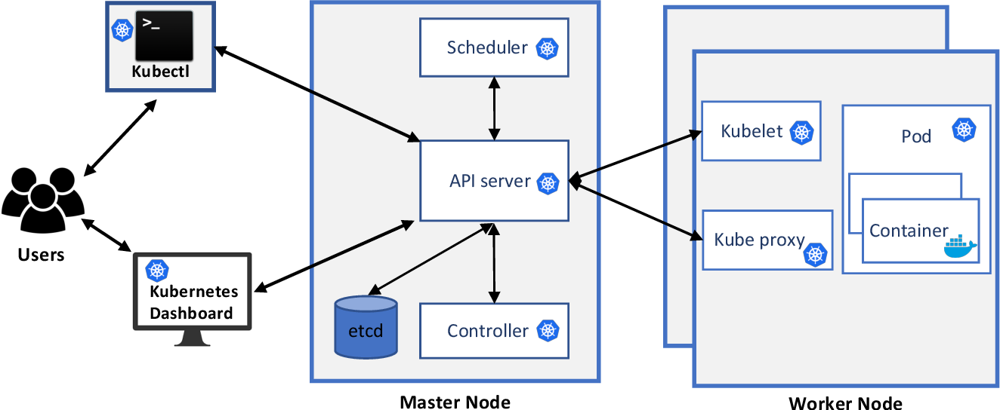

## 📌 Description

Kubernetes security covers **authentication, authorization, TLS, secrets management, and network isolation**. Securing a cluster means controlling who can access the API, what they can do, and what traffic is allowed between workloads.

## 🧩 Security Layers

| Layer | Topics |
|---|---|
| Identity & Access | [[Authentication]], [[Role Based Access Control]], [[Cluster Roles]], [[Service Accounts]] |
| TLS / Certificates | [[TLS in kubernetes]], [[TLS in Kubernetes - Certificate creation]], [[View all the certificates in K8S cluster]], [[certificates api]] |
| API & Config | [[Kube-Config]], [[API groups]], [[Authorization]] |
| Workload Security | [[image security]], [[Security context]], [[Network Policies]] |
| Extensibility | [[CRD Custom Resource Definition]], [[custom controllers]], [[operator framework]] |

## 📂 Subtopics

- [[Authentication]]
- [[TLS in kubernetes]]
- [[TLS in Kubernetes - Certificate creation]]
- [[View all the certificates in K8S cluster]]
- [[certificates api]]
- [[KubeConfig]]
- [[API groups]]
- [[Authorization]]
- [[Role Based Access Control]]
- [[Cluster Roles]]
- [[Service Accounts]]
- [[image security]]
- [[Security context]]
- [[Network Policies]]
- [[CRD Custom Resource Definition]]
- [[custom controllers]]
- [[operator framework]]

## 🔗 Useful Links

- [Kubernetes Security Docs](https://kubernetes.io/docs/concepts/security/)

🏷️ Tags: #security #rbac #tls #authentication #authorization #networkpolicies #k8s
